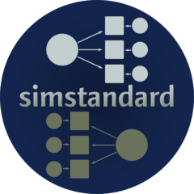

<!-- README.md is generated from README.Rmd. Please edit that file -->

```{r, echo = FALSE}
knitr::opts_chunk$set(
  collapse = TRUE,
  comment = "#>",
  fig.path = "README-"
)
```

# simstandard 

[](https://cran.r-project.org/package=simstandard)
[](http://www.rdocumentation.org/packages/simstandard)
`r badger::badge_devel("wjschne/simstandard", "blue")`
[](https://www.tidyverse.org/lifecycle/#maturing)
[](https://travis-ci.org/wjschne/simstandard)
[](https://ci.appveyor.com/project/wjschne/simstandard)
[](https://codecov.io/github/wjschne/simstandard?branch=master)


Sometimes you have a structural model with standardized path coefficients, structural coefficients, and correlations, but you do not know the error and disturbance variances. The purpose of `simstandard` is to calculate these variances and then simulate multivariate normal data based on your model.

## Installation

You can either install simstandard from CRAN or install the
development version of simstandard from github.

### Option 1: Install the most recent stable release from CRAN

You can install simstandard from CRAN by running this code:

```{r, eval = FALSE}
install.packages("simstandard")
```

### Option 2: Install the development version from GitHub

To install the development version of simstandard, you need to check
if devtools is installed. If not, run this:

```{r, eval = FALSE}
install.packages("devtools")
```

Once you are sure you have devtools installed, you can install the
development version of simstandard from GitHub by running this code:

```{r, eval = FALSE}
devtools::install_github("wjschne/simstandard")
```


## Example

The `simstandard` package uses [lavaan syntax](http://lavaan.ugent.be/tutorial/syntax1.html) to specify models.

```{r example}
library(simstandard)
model <- "
A =~ 0.5 * A1 + 0.8 * A2
B =~ 0.6 * B1 + 0.7 * B2
B ~ 0.8 * A
C ~~ 0.5 * A
"
data <- sim_standardized(m = model, n = 500)

knitr::kable(head(data), digits = 2)
```

See more in the [tutorial for this package](https://wjschne.github.io/simstandard/articles/simstandard_tutorial.html).
