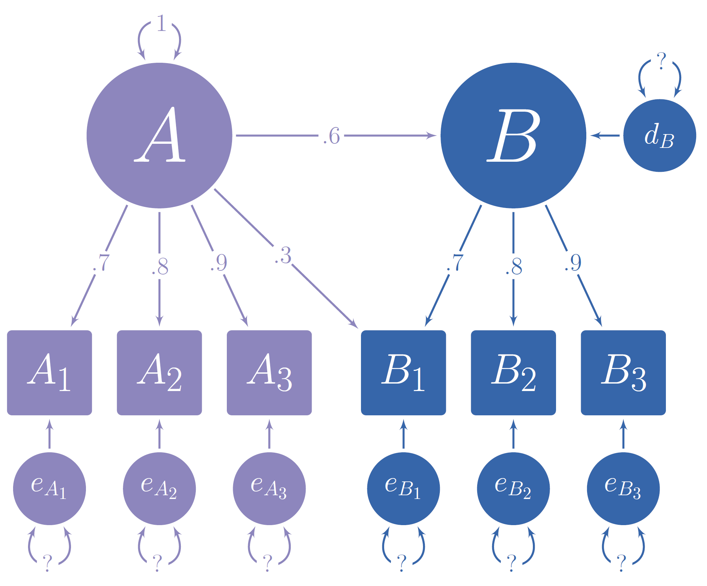
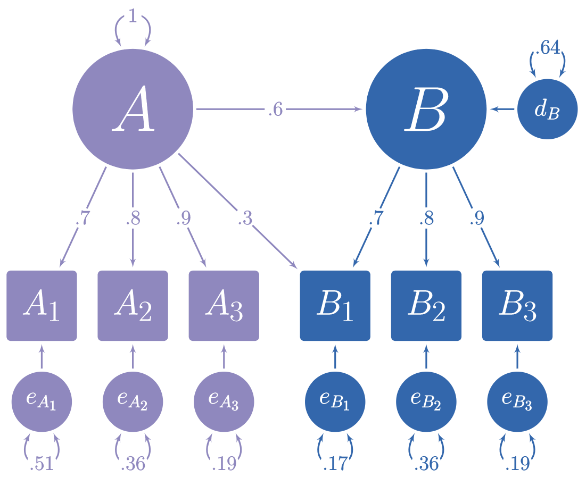

```{r setup, include = FALSE}
knitr::opts_chunk$set(
  collapse = TRUE,
  comment = "#>",
  out.height = "100%",
  out.width = "100%",
  fig.width = 7,
  fig.height = 7
)
library(lavaan)
library(simstandard)
library(knitr)
library(ggplot2)
library(tibble)
library(tidyr)
library(dplyr)

set.seed(123456)
```

[{width=120 align="right"}](https://wjschne.github.io/simstandard/)

# Purpose of simstandard

In the figure below, you can see a hypothetical structural model with its standardized loadings and path coefficients.

```{r, out.width=700, fig.align='center', echo = FALSE}

```

Suppose you need to simulate multivariate normal data based on this model, but you do not know the error variances and the latent disturbance variances needed to make your model produce standardized data. It is often difficult to find such values algebraically, and instead they must be found iteratively.

The simstandard package finds the standardized variances and creates standardized multivariate normal data using [lavaan syntax](https://lavaan.ugent.be/tutorial/syntax1.html). It can also create latent variable scores, error terms, disturbance terms, estimated factor scores, and equally weighted composite scores for each latent variable.

# Generate Model-Based Multivariate Data

```{r generate}
library(simstandard)
library(lavaan)
library(knitr)
library(dplyr)
library(ggplot2)
library(tibble)
library(tidyr)

# lavaan syntax for model
m <- "
A =~ 0.7 * A1 + 0.8 * A2 + 0.9 * A3 + 0.3 * B1
B =~ 0.7 * B1 + 0.8 * B2 + 0.9 * B3
B ~ 0.6 * A
"

# Simulate data
d <- sim_standardized(m, n = 100000)

# Display First 6 rows
head(d)
```

Let's make a function to display correlations and covariance matrices:

```{r corfunction}
ggcor <- function(d) {
  as.data.frame(d) %>%
    tibble::rownames_to_column("rowname") %>%
    tidyr::pivot_longer(-rowname, names_to = "colname", values_to = "r") %>%
    dplyr::mutate(rowname = forcats::fct_inorder(rowname) %>%
                    forcats::fct_rev()) %>%
    dplyr::mutate(colname = factor(colname,
                                   levels = rev(levels(rowname)))) %>%
    ggplot(aes(colname, rowname, fill = r)) +
    geom_tile(color = "gray90") +
    geom_text(
      aes(
        label = formatC(r, digits = 2, format = "f") %>%
          stringr::str_replace_all("0\\.", ".") %>%
          stringr::str_replace_all("1.00", "1")
      ),
      color = "white",
      fontface = "bold",
      family = "serif"
    ) +
    scale_fill_gradient2(
      NULL,
      na.value = "gray20",
      limits = c(-1.01, 1.01),
      high = "#924552",
      low = "#293999"
    ) +
    coord_equal() +
    scale_x_discrete(NULL, position = "top") +
    scale_y_discrete(NULL) +
    theme_light(base_family = "serif", base_size = 14)
}

```

Because the data are standardized, the covariance matrix of the observed and latent variables should be nearly identical to a correlation matrix. The error and disturbance terms are not standardized.

```{r modelcov}
cov(d) %>%
  ggcor()
```

To return only the observed variables

```{r observed}
d <- sim_standardized(m,
                      n = 100000,
                      latent = FALSE,
                      errors = FALSE)
# Display First 6 rows
head(d)
```

# Comparison with `lavaan::simulateData`

I love the lavaan package. However, one aspect of one function in lavaan is not quite right yet. lavaan's `simulateData` function [is known to generate non-standardized data](https://github.com/yrosseel/lavaan/issues/46), even when the `standardized` parameter is set to `TRUE`. See how it creates variable Y with a variance higher than 1.

```{r lavaan}
test_model <- "
Y ~ -.75 * X_1 + .25 * X_2
X =~ .75 * X_1 + .75 * X_2
"

library(lavaan)
d_lavaan <- simulateData(model = test_model,
                         sample.nobs = 100000,
                         standardized = TRUE)
cov(d_lavaan) %>%
  ggcor()
```

With the same test model, simstandard will calculate variables with variances of 1.

```{r simstandard_comparison}
sim_standardized(test_model,
                 n = 100000,
                 errors = FALSE) %>%
  cov %>%
  ggcor()
```

# Inspecting model matrices

You can inspect the matrices that simstandard uses to create the data by calling `simstandardized_matrices`.

```{r simmatrices}
matrices <- sim_standardized_matrices(m)
```

The A matrix contains all the asymmetric path coefficients (i.e., the loadings and the structural coefficients). These coefficients are specified in the lavaan model syntax.

```{r Amatrix}
matrices$RAM_matrices$A %>%
  ggcor()
```

The S matrix contains all the symmetric path coefficients (i.e., the variances and correlations of the observed and latent variables). For endogenous variables, the variances and correlations refer to the variance and correlations of the variable's associated error or disturbance term. In this case, A is the only endogenous variable, and thus its variance on the diagonal of the S matrix is 1.

```{r Smatrix}
matrices$RAM_matrices$S %>%
  ggcor()
```

Thus, we can use these results to insert the missing values from the path diagram at the beginning of this tutorial

```{r modelcomplete, out.width=700, fig.align='center', echo = FALSE}

```

# Estimated Factor Scores

If you want to estimate factor scores using the regression method (i.e., Thurstone's method), set `factor_scores` to `TRUE`. All scores ending in *FS* are factor score estimates.

```{r estfactorscores}
m <- "
A =~ 0.9 * A1 + 0.8 * A2 + 0.7 * A3
"
sim_standardized(m,
                 n = 100000,
                 factor_scores = TRUE) %>%
  head()
```

## Adding factor scores to new data

Suppose you have some new data and wish to add estimated factor scores to it. The `add_factor_scores` function will take your data and return your data with the estimated factors added to it.

```{r add_factor_scores}
d <- tibble::tribble(
  ~A1,  ~A2,  ~A3,
   2L,  2.5,  1.3,
  -1L, -1.5, -2.1
  )

add_factor_scores(d, m)

```

# Composite Scores

If you want to calculate equally-weighted composite scores based on the indicators of each latent variable, set \`composites = TRUE'.

```{r composites}
m <- "
A =~ 0.9 * A1 + 0.8 * A2 + 0.7 * A3
"
sim_standardized(
  m,
  n = 100000,
  composites = TRUE
  ) %>%
  head()
  
```

Composite scores with equal weights can also be added to new data:

```{r add_composite_scores}
add_composite_scores(d, m)
```

# Return lavaan syntax with all parameters set free

Suppose that we want to verify that the data generated by the `sim_standardized` function is correct. We will need an analogous model, but with all the fixed parameters set free. We could manually remove the fixed parameter values, but with large models the process is tedious and introduces a risk of error. The `fixed2free` function painlessly removes the fixed parameters values from the model.

```{r fix2free}
# lavaan syntax for model
m <- "
A =~ 0.7 * A1 + 0.8 * A2 + 0.9 * A3 + 0.3 * B1
B =~ 0.7 * B1 + 0.8 * B2 + 0.9 * B3
B ~ 0.6 * A
"
# Make model m free
m_free <- fixed2free(m)
# Display model m_free
cat(m_free)
```

Now let's use lavaan to see if the observed data in `d` conform to the model in `m_free`.

```{r lavaantest}
# Set the random number generator for reproducible results
set.seed(12)
# Generate data based on model m
d <- sim_standardized(
  m,
  n = 100000,
  latent = FALSE,
  errors = FALSE)

# Evaluate the fit of model m_free on data d
library(lavaan)
lav_results <- sem(
  model = m_free,
  data = d)

# Display summary of model
summary(
  lav_results,
  standardized = TRUE,
  fit.measures = TRUE)

# Extract RAM paths
ram <- lav2ram(lav_results)

# Display asymmetric paths (i.e., single-headed arrows for
# loadings and structure coefficients)
ram$A %>% ggcor()

# Display symmetric paths (i.e., curved double-headed arrows
# exogenous variances, error variances, disturbance variances,
# and any covariances among these)
ram$S %>% ggcor()

```

As can be seen, all the fit measures indicate a near-perfect fit, and the parameter estimates are within rounding error of the fixed parameters in model `m`.

# Return lavaan syntax for a model with standardized variances specified

Although the `simstandardized` function will generate data for you, you might want to use a function from a different package instead, such as `lavaan::simulateData` or `simsem::sim`. In this case, you can use the `model_complete` function to output the lavaan syntax for a standardized model with all standardized variances specified.

```{r mcomplete}
# Specify model
m <- "
A =~ 0.7 * A1 + 0.8 * A2 + 0.9 * A3 + 0.3 * B1
B =~ 0.7 * B1 + 0.8 * B2 + 0.9 * B3
B ~ 0.6 * A
"
m_complete <- model_complete(m)
# Display complete model
cat(m_complete)
```

# Return lavaan syntax from matrices

Suppose that a research article provides model coefficients in a table. We could spend time creating lavaan syntax by hand, but such work can be tedious. The `matrix2lavaan` function can help save time when the models are already specified in matrix form.

## The measurement model

The measurement model can be specified with a matrix in which the column names are latent variables and the row names are indicator variables.

Here we have three latent variables, Vocabulary, Working Memory Capacity, and Reading, each defined by three indicator variables.

```{r measurementmatrix}
m_meas <- matrix(c(
  .8, 0, 0,  # VC1
  .9, 0, 0,  # VC2
  .7, 0, 0,  # VC3
  0, .6, 0,  # WM1
  0, .7, 0,  # WM2
  0, .8, 0,  # WM3
  0, 0, .9,  # RD1
  0, 0, .7,  # RD2
  0, 0, .8), # RD3
  nrow = 9,
  byrow = TRUE,
  dimnames = list(
    c("VC1", "VC2", "VC3",
      "WM1", "WM2", "WM3",
      "RD1", "RD2", "RD3"),
    c("Vocabulary", "WorkingMemory", "Reading")
  ))

```

## The structural model

The structural model can be specified with a matrix in which the predictors are the column names and the criterion variables are the row names.

Here we have Vocabulary and Working Memory Capacity predicting Reading Scores.

```{r structmatrix}
m_struct <- matrix(c(0.4, 0.3),
                   ncol = 2,
                   dimnames = list("Reading",
                                   c("Vocabulary", "WorkingMemory")))

```

This could have been a 3 by 3 matrix with zeroes (which are ignored).

```{r mstruct}
m_struct <- matrix(c(0,   0,   0,  # Vocabulary
                     0,   0,   0,  # WorkingMemory
                     0.4, 0.3, 0), # Reading
                   nrow = 3,
                   byrow = TRUE)
rownames(m_struct) <- c("Vocabulary", "WorkingMemory", "Reading")
colnames(m_struct) <- c("Vocabulary", "WorkingMemory", "Reading")
```

## Covariances

The variances and covariances must be specified as a symmetric matrix, though variables can be omitted.

Here we specify that the latent variables Vocabulary and Working Memory Capacity are correlated.

```{r mcov}
m_cov <- matrix(c(1,   0.5,
                  0.5, 1),
                nrow = 2,
                dimnames = list(
                  c("Vocabulary", "WorkingMemory"),
                  c("Vocabulary", "WorkingMemory")
                ))
```

## Using the `matrix2lavaan` function

The `matrix2lavaan` function takes arguments for the measurement model, structural model, and covariances. Any of the three matrices can be omitted.

```{r showmodel}
model <- matrix2lavaan(measurement_model = m_meas,
                       structural_model = m_struct,
                       covariances = m_cov)
cat(model)
```

## Specifying models with data.frames instead of matrices

As an alternative, the `matrix2lavaan` function can take data.frames (or tibbles) with either rownames or the first column as a character vector.

```{r matrix2lavaan}
# A tibble with indicator variables listed in the first column
m_meas <- tibble::tribble(
     ~Test, ~Vocabulary, ~WorkingMemory, ~Reading,
     "VC1",         0.8,              0,        0,
     "VC2",         0.9,              0,        0,
     "VC3",         0.7,              0,        0,
     "WM1",           0,            0.6,        0,
     "WM2",           0,            0.7,        0,
     "WM3",           0,            0.8,        0,
     "RD1",           0,              0,      0.9,
     "RD2",           0,              0,      0.7,
     "RD3",           0,              0,      0.8)

# A data.frame with criterion variable specified as a row name
m_struct <- data.frame(Vocabulary = 0.4,
                       WorkingMemory = 0.3,
                       row.names = "Reading")

# A data.frame with variable names specified as row names
m_cov <- data.frame(Vocabulary = c(1, 0.5),
                    WorkingMemory = c(0.5, 1))
rownames(m_cov) <- c("Vocabulary", "WorkingMemory")


model <- matrix2lavaan(measurement_model = m_meas,
                       structural_model = m_struct,
                       covariances = m_cov)
```


# Return model-implied correlation matrices

After specifying a standardized model with lavaan syntax, we can extract a model-implied correlation matrix. By default, we extract just the correlations among the observed variables.

```{r modelimpliedcor}
get_model_implied_correlations(m) %>%
  ggcor()
```

It is possible to extract the model-implied correlations among the observed variables, latent variables, error terms, factor scores, and composite variables. For example, here we extract correlations among the observed and latent variables:

```{r corplot}
get_model_implied_correlations(
  m,
  latent = TRUE) %>%
  ggcor()
```


```{r msyntax}
# lavaan syntax for model
m <- "
A =~ 0.7 * A1 + 0.8 * A2 + 0.9 * A3 + 0.3 * B1
B =~ 0.7 * B1 + 0.8 * B2 + 0.9 * B3
B ~ 0.6 * A

# Variances
A1 ~~ 0.51 * A1
A2 ~~ 0.36 * A2
A3 ~~ 0.19 * A3
B1 ~~ 0.168 * B1
B2 ~~ 0.36 * B2
B3 ~~ 0.19 * B3
A ~~ 1 * A
B ~~ 0.64 * B
"

m_fit <- lavaanify(m) 
  

# mRAM <- lavMatrixRepresentation(m_fit, 
                                # representation = "RAM")

v <- list(
    v_latent_exogenous = lavNames(m_fit, "lv.x"),
    v_latent_endogenous = lavNames(m_fit, "lv.nox"),
    v_observed_exogenous = lavNames(m_fit, "ov.x"),
    v_observed_endogenous = lavNames(m_fit, "ov.nox"),
    v_observed_indicator = lavNames(m_fit, "ov.ind"),
    v_disturbance = paste0("d_", lavNames(m_fit, "lv.nox")),
    v_error = paste0("e_", lavNames(m_fit, "ov.nox"))
  )

v$v_residual <- c(v$v_error,
                        v$v_disturbance)
v$v_exogenous <- c(v$v_residual,
                         v$v_observed_exogenous,
                         v$v_latent_exogenous)
v$v_endogenous <- c(v$v_observed_endogenous,
                          v$v_latent_endogenous)
v$v_modeled <- c(v$v_endogenous,
                       v$v_latent_exogenous,
                       v$v_observed_exogenous)
v$v_observed <- c(v$v_observed_exogenous, 
                        v$v_observed_endogenous)
v$v_latent <- c(v$v_latent_exogenous, 
                      v$v_latent_endogenous)

# Reduced ram
rram <- list()
rram$A <- matrix(0, 
                 nrow = length(v$v_modeled), 
                 ncol = length(v$v_modeled), 
                 dimnames = list(v$v_modeled, v$v_modeled))
rram$S <- rram$A 
rram$F <- matrix(
  0,
  nrow = length(v$v_observed),
  ncol = length(v$v_modeled),
  dimnames = list(v$v_observed, v$v_modeled)
)


m_fit |> 
  filter(op == "=~") |> 
  
  select(rhs, lhs, ustart)

m_fit |> 
  filter(op == "~") |> 
  select(lhs, rhs, ustart)

d_A <- m_fit |> 
  filter(op %in% c("=~", "~")) |> 
  mutate(cause = if_else(op == "~", rhs, lhs),
         effect = if_else(op == "~", lhs, rhs))

d_S <- m_fit |> 
  filter(op %in% c("~~")) 

rram$A[cbind(d_A$effect, d_A$cause)] <- d_A$ustart
rram$S[cbind(d_S$lhs, d_S$rhs)] <- d_S$ustart
rram$S[cbind(d_S$rhs, d_S$lhs)] <- d_S$ustart
rram$F[cbind(v$v_observed, v$v_observed)] <- 1

dimnames(rram$S) <- list(v$v_exogenous, v$v_exogenous)


extended_diag <- matrix(0, nrow = nrow(rram$A), ncol = length(v$v_residual)) |> 
  `dimnames<-`(list(rownames(rram$A), v$v_residual)) |> 
  `diag<-`(sqrt(diag(rram$S[v$v_residual, v$v_residual])))
extended_A <- cbind(rram$A, extended_diag) |> 
  rbind(matrix(0, nrow = length(v$v_residual),
               ncol = length(v$v_residual) + nrow(rram$A))) %>%
  `rownames<-`(colnames(.))

# Identity matrix the same size as A and S
I <- diag(nrow(extended_A)) 

# Inverted I - A for total effects (direct + indirect)
iA <- solve(I - extended_A) 

# Exogenous covariance matrix
extended_S <- matrix(0, 
                     nrow = nrow(extended_A), 
                     ncol = ncol(extended_A)) |> 
  `dimnames<-`(dimnames(extended_A))
# diag(extended_S) <- 1
extended_S[cbind(rownames(rram$S), colnames(rram$S))] <- 1

extended_cov <- iA %*% extended_S %*% t(iA)

extended_mu <- rep(0, nrow(extended_A)) |> `names<-`(rownames(extended_A))
extended_mu[v$v_residual] <- 0

eigen(rram$S, symmetric = T)


((iA %*% extended_S %*% t(iA))[,v$v_exogenous] ^ 2) |> 
  as.data.frame() |> 
  rownames_to_column("variable") |> 
  pivot_longer(-variable, names_to = "exogenous") |> 
  filter(value != 0) |> 
  arrange(exogenous) |> 
  ggplot(aes(variable, value)) + 
  geom_col(aes(fill = exogenous))


(iA %*% extended_S %*% t(iA))[v$v_endogenous,v$v_exogenous]

```

