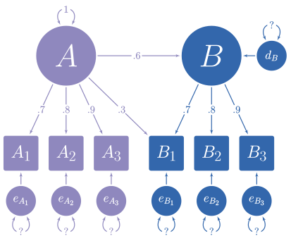

```{r setup, include = FALSE}
knitr::opts_chunk$set(
  collapse = TRUE,
  comment = "#>"
)
```

In the figure below, you can see a hypothetical structural model with its standardized loadings, path coefficients, and covariances (i.e., standardized covariances = correlations). 


```{r, out.width=650, fig.align='center', echo = FALSE}

```

You need simulate multivariate normal data based on this model, but you do not know the error variances and the latent disturbance variances needed to make your model produce standardized data. It is often difficult to find such values algebraically and instead must be found iteratively.

The `simstandard` package creates multivariate normal data using lavaan syntax.

```{r}
library(simstandard)
# lavaan syntax for model
m <- "
A =~ 0.7 * A1 + 0.8 * A2 + 0.9 * A3 + 0.3 * B1
B =~ 0.7 * B1 + 0.8 * B2 + 0.9 * B3
B ~ 0.6 * A
"

# Simulate data
d <- sim_standardized(m, n = 100000)

# Display First 6 rows
knitr::kable(head(d), digits = 2)
```

```{r, eval = FALSE}
cor(d)
```


```{r, echo = FALSE}
# Create correlation matrix
R <- cor(d)

# Display correlation matrix
knitr::kable(R, digits = 2)
```

To return only the observed variables
```{r}
d <- sim_standardized(m,
                      n = 100000,
                      latent = FALSE,
                      errors = FALSE,
                      disturbances = FALSE)
# Display First 6 rows
knitr::kable(head(d), digits = 2)
```


You can inspect the matrices that simstandard uses to create the data by calling `simstandardized_matrices`.

```{r}
matrices <- sim_standardized_matrices(m)
```

The A matrix contains all the asymmetric path coefficients (i.e., the loadings and the structural coefficients). These coefficients are specified in the lavaan model syntax.

```{r, eval=FALSE}
matrices$RAM_matrices$A
```

```{r, echo=FALSE}
knitr::kable(matrices$RAM_matrices$A)
```


The S matrix contains all the symmetric path coefficients (i.e., the variances and correlations of the observed and latent variables). For endogenous variables, the variances and correlations refer to the variance and correlations of the variable's associated error or disturbance term. In this case, A is the only endogenous variable, and this its variance on the diagonal of the S matrix is 1.

```{r, eval=FALSE}
matrices$RAM_matrices$S, digits = 2
```

```{r, echo=F}
knitr::kable(matrices$RAM_matrices$S, digits = 2)
```


