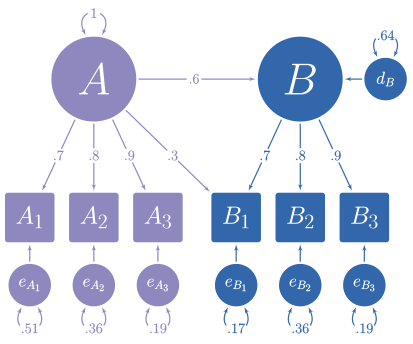

```{r setup, include = FALSE}
knitr::opts_chunk$set(
  collapse = TRUE,
  comment = "#>",
  dev = "svg",
  out.height = "100%",
  out.width = "100%",
  fig.width = 7,
  fig.height = 7
  )
library(lavaan)
library(simstandard)
library(knitr)
library(ggplot2)
library(tibble)
library(tidyr)
library(dplyr)
library(kableExtra)

options(digits = 2)
```

# Purpose of `simstandard`

In the figure below, you can see a hypothetical structural model with its standardized loadings and path coefficients. 


```{r, out.width=700, fig.align='center', echo = FALSE}
knitr::include_graphics("ModelFigure.svg")
```

Suppose you need to simulate multivariate normal data based on this model, but you do not know the error variances and the latent disturbance variances needed to make your model produce standardized data. It is often difficult to find such values algebraically and instead they must be found iteratively.

The `simstandard` package creates multivariate normal data using lavaan syntax. It can also create latent variable scores, error terms, disturbance terms, estimated factor scores, and equally weighted composite scores for each latent variable.

# Generate Model-Based Multivariate Data

```{r}
library(simstandard)
library(lavaan)
library(knitr)
library(kableExtra)
library(dplyr)
library(ggplot2)
library(tibble)
library(tidyr)

# lavaan syntax for model
m <- "
A =~ 0.7 * A1 + 0.8 * A2 + 0.9 * A3 + 0.3 * B1
B =~ 0.7 * B1 + 0.8 * B2 + 0.9 * B3
B ~ 0.6 * A
"

# Simulate data
d <- sim_standardized(m, n = 100000)

# Display First 6 rows
head(d) %>% 
  kable() %>% 
  kable_styling()
```

Let's make a function to display correlations and covariance matrices:

```{r}
ggcor <- function(d) {
  require(ggplot2)
  as.data.frame(d) %>%
    tibble::rownames_to_column("rowname") %>%
    tidyr::gather(colname, r, -rowname) %>%
    dplyr::mutate(rowname = forcats::fct_rev(rowname)) %>% 
    ggplot(aes(colname, rowname, fill = r)) +
    geom_tile(color = "gray90") +
    geom_text(aes(
      label = formatC(
      r, 
      digits = 2, 
      format = "f") %>% 
        stringr::str_replace_all("0\\.",".") %>% 
        stringr::str_replace_all("1.00","1")), 
    color = "white", 
    fontface = "bold",
    family = "serif") +
    scale_fill_gradient2(NULL,
      na.value = "gray20",
      limits = c(-1.01, 1.01),
      high = "#924552",
      low = "#293999"
    ) +
    coord_equal() +
    scale_x_discrete(NULL,position = "top") +
    scale_y_discrete(NULL) +
    theme_light(base_family = "serif", base_size = 14) 
}

```

Because the data are standardized, the covariance matrix of the observed and latent variables should be nearly identical to a correlation matrix. The error and disturbance terms are not standardized.

```{r modelcov}
cov(d) %>% 
  ggcor
```

To return only the observed variables

```{r}
d <- sim_standardized(m,
                      n = 100000,
                      latent = FALSE,
                      errors = FALSE)
# Display First 6 rows
head(d) %>% 
  kable() %>% 
  kable_styling()
```


# Comparison with `lavaan::simulateData`

I love the `lavaan` package. However, one aspect of one function in `lavaan` is not quite right yet. `lavaan`'s `simulateData` function [is known to generate non-standardized data](https://github.com/yrosseel/lavaan/issues/46), even when the `standardized` parameter is set to `TRUE`. See how it creates variables B1, B2, and B3 with variances much higher than 1. Furthermore, it only produces observed variables.

```{r lavaan}
library(lavaan)
d_lavaan <- simulateData(
  model = m, 
  sample.nobs = 100000, 
  standardized = TRUE)
cov(d_lavaan) %>% 
  ggcor
```

# Inspecting model matrices

You can inspect the matrices that simstandard uses to create the data by calling `simstandardized_matrices`.

```{r}
matrices <- sim_standardized_matrices(m)
```

The A matrix contains all the asymmetric path coefficients (i.e., the loadings and the structural coefficients). These coefficients are specified in the lavaan model syntax.

```{r Amatrix}
matrices$RAM_matrices$A %>% 
  ggcor()
```

The S matrix contains all the symmetric path coefficients (i.e., the variances and correlations of the observed and latent variables). For endogenous variables, the variances and correlations refer to the variance and correlations of the variable's associated error or disturbance term. In this case, A is the only endogenous variable, and this its variance on the diagonal of the S matrix is 1.

```{r Smatrix}
matrices$RAM_matrices$S %>% 
  ggcor()
```

Thus, we can use these results to insert the missing values from the path diagram at the beginning of this tutorial

```{r, out.width=700, fig.align='center', echo = FALSE}

```

# Estimated Factor Scores

If you want to estimate factor scores using the regression method (i.e., Thurstone's method), set `factor_scores = TRUE'. All scores ending in "_FS" are factor score estimates.

```{r}
m <- "
A =~ 0.9 * A1 + 0.8 * A2 + 0.7 * A3
"
sim_standardized(
  m, 
  n = 100000, 
  factor_scores = TRUE
  ) %>% 
  head() %>% 
  kable() %>% 
  kable_styling()
```

# Composite Scores

If you want to calculate equally-weighted composite scores based on the indicators of each latent variable, set `composites = TRUE'. 

```{r}
m <- "
A =~ 0.9 * A1 + 0.8 * A2 + 0.7 * A3
"
sim_standardized(
  m, 
  n = 100000, 
  composites = TRUE
  ) %>% 
  head() %>% 
  kable() %>% 
  kable_styling()
  
```

# Using the `fixed2free` function to set fixed parameters free

Suppose that we want to verify that the data generated by the `sim_standardized` function is correct. We will need an analogous model, but with all the fixed parameters set free. We could manually remove the fixed parameter values, but with large models the process is tedious and introduces a risk of error. The `fixed2free` function removes the fixed parameters values painlessly from the model.

```{r}
# lavaan syntax for model
m <- "
A =~ 0.7 * A1 + 0.8 * A2 + 0.9 * A3 + 0.3 * B1
B =~ 0.7 * B1 + 0.8 * B2 + 0.9 * B3
B ~ 0.6 * A
"
# Make model m free
m_free <- fixed2free(m)
# Display model m_free
cat(m_free)
```

Now let's use `lavaan` to see if the observed data in `d` conform to the model in `m_free`.

```{r}
# Set the random number generator for reproducible results
set.seed(12)
# Generate data based on model m
d <- sim_standardized(
  m,
  n = 100000,
  latent = FALSE,
  errors = FALSE)

# Evaluate the fit of model m_free on data d
library(lavaan)
lav_results <- sem(
  model = m_free, 
  data = d)

# Display summary of model
summary(
  lav_results, 
  standardized = TRUE, 
  fit.measures = TRUE)

# Extract RAM paths
RAM <- semPlot::modelMatrices(lav_results)
# Display asymmetric paths (i.e., single-headed arrows for 
# loadings and structure coefficients)
RAM$A[[1]]$std %>% ggcor()
# Display symmetric paths (i.e., curved double-headed arrows
# exogenous variances, error variances, disturbance variances, 
# and any covariances among these)
RAM$S[[1]]$std %>% ggcor()

```

As can be seen, all the fit measures indicate a near-perfect fit, and the parameter estimates are within rounding error of the fixed parameters in model `m`.


# Using the `model_complete` function to return `lavaan` syntax for a full model with standardized variances specified

If you want to use the excellent [`simsem` package ](https://cran.r-project.org/package=simsem) to conduct a power analysis or to perform methodological investigations, `simstandard` can output the `lavaan` syntax for a standardized model with all variances specified.

```{r}
# Specify model
m <- "
A =~ 0.7 * A1 + 0.8 * A2 + 0.9 * A3 + 0.3 * B1
B =~ 0.7 * B1 + 0.8 * B2 + 0.9 * B3
B ~ 0.6 * A
"
m_complete <- model_complete(m)
# Display complete model
cat(m_complete)

# Make a model with all parameters set free
m_free <- fixed2free(m)
# Display free model
cat(m_free)

# Use simsem to make 20 samples of 150 each (real analyses would be larger)
library(simsem)
simsem_output <- simsem::sim(
  nRep = 20, 
  model = m_free, 
  generate = m_complete,
  n = 150, 
  lavaanfun = "cfa", 
  silent = TRUE
  )
# Summary of output
summary(simsem_output)
# View summary with standardized parameters
summaryParam(simsem_output, std = TRUE) %>% 
  kable(digits = 2)

```

